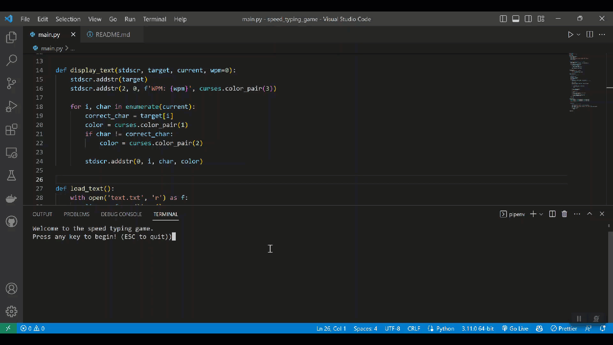

# Speed Typing Game

> The Speed Typing Game is a straightforward game designed to assess the player's typing abilities using the curses library.

## Demo



## Usage

#
1: Create a virtual environment:

```bash
pipenv shell
```

#
2: Install the dependencies:

```bash
pipenv install -r requirements.txt 
```

#
3: Run server:

```bash
python main.py
```


## License
MIT © iAlex0

